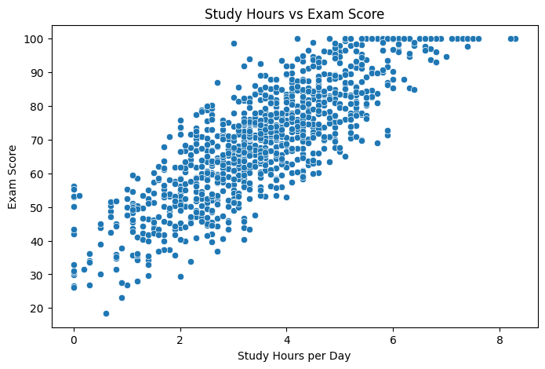
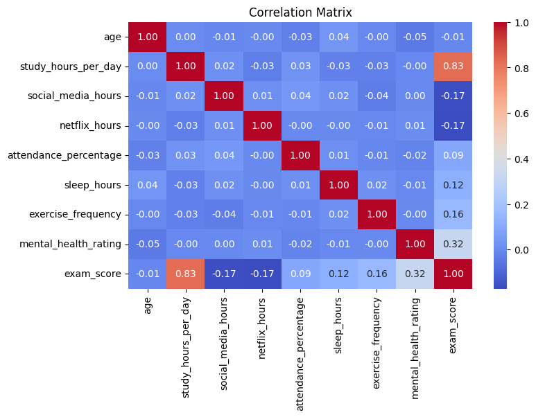
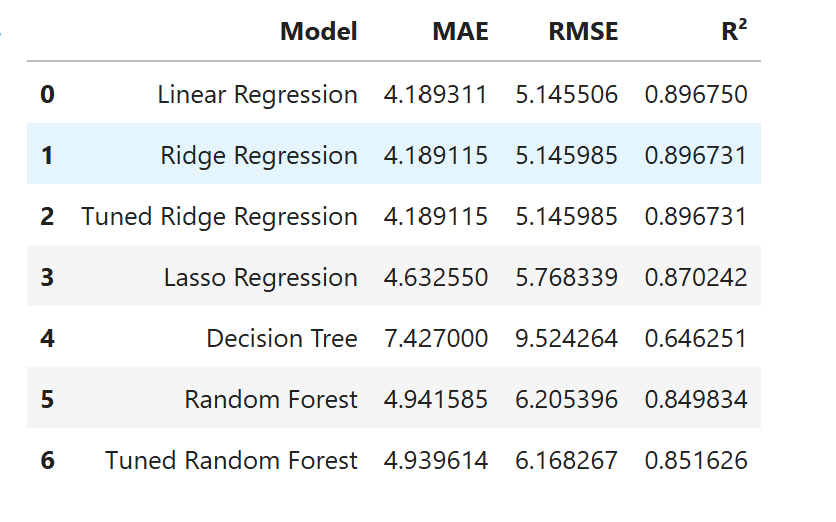
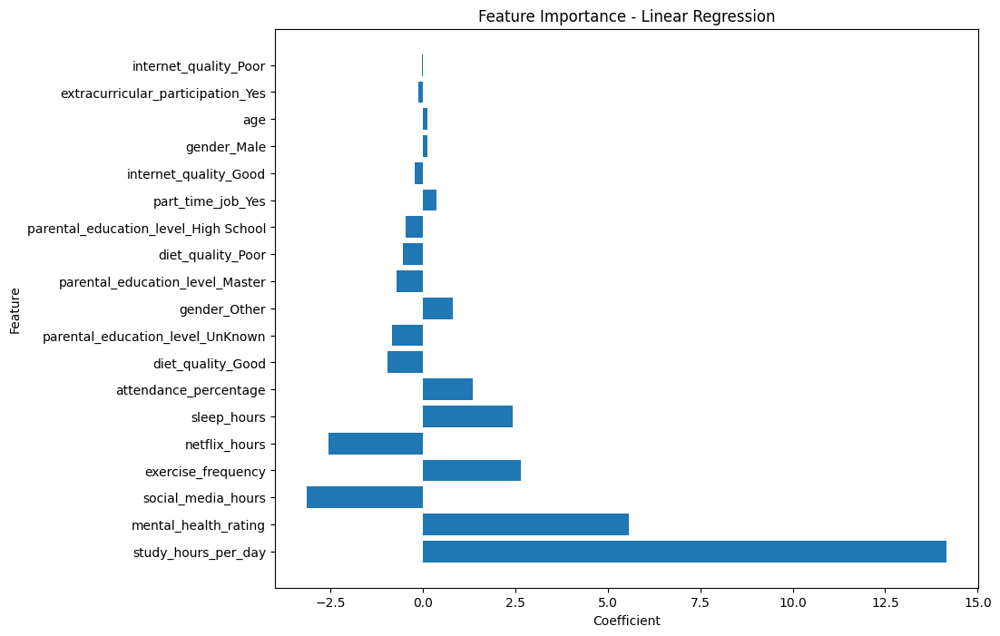

# 🎓 Student Exam Score Prediction

A Machine Learning project that predicts a student's exam score based on study habits, lifestyle factors, and academic-related features.

The project follows an end-to-end Machine Learning workflow, including data cleaning, exploratory data analysis, feature engineering, preprocessing, model training, model comparison, evaluation, and Streamlit deployment.

## 🚀 Live Demo

🔗 [Try the Streamlit App](https://student-exam-score-prediction-knbeeasetgdmvthtzoijfd.streamlit.app/)

---

## 📊 Dataset

The dataset used in this project is the **Student Habits vs Academic Performance** dataset from Kaggle.

🔗 [Student Habits vs Academic Performance — Kaggle](https://www.kaggle.com/datasets/jayaantanaath/student-habits-vs-academic-performance)

The dataset contains **1,000 student records** and **15 columns** describing students' habits, lifestyle, and academic-related information.

### Target Variable

- `exam_score` — Student's exam score

### Numerical Features

- `age`
- `study_hours_per_day`
- `social_media_hours`
- `netflix_hours`
- `attendance_percentage`
- `sleep_hours`
- `exercise_frequency`
- `mental_health_rating`

### Categorical Features

- `gender`
- `part_time_job`
- `diet_quality`
- `parental_education_level`
- `internet_quality`
- `extracurricular_participation`

---

## 🔎 Exploratory Data Analysis

The exploratory analysis was performed to understand the relationships between student habits and exam performance.

### Study Hours vs Exam Score

Study hours showed a strong positive relationship with exam scores.

The scatter plot shows a clear upward trend, with students who spend more time studying generally having higher exam scores.



### Correlation Analysis

The correlation analysis showed several relationships with exam scores:

- `study_hours_per_day` had the strongest positive correlation with `exam_score` at **0.83**.
- `mental_health_rating` had a moderate positive correlation of **0.32**.
- `exercise_frequency` had a positive correlation of **0.16**.
- `sleep_hours` had a positive correlation of **0.12**.
- `attendance_percentage` had a positive correlation of **0.09**.
- `social_media_hours` and `netflix_hours` both had negative correlations of approximately **-0.17**.



---

## ⚙️ Feature Engineering & Preprocessing

The categorical features were converted into numerical dummy variables so they could be used by the Machine Learning models.

The numerical features were standardized using `StandardScaler`.

The scaler was fitted only on the training data and then used to transform both the training and test data.

The target variable `exam_score` was not scaled.

---

## 🤖 Machine Learning Models

Several regression models were trained and compared:

- Linear Regression
- Ridge Regression
- Lasso Regression
- Decision Tree Regressor
- Random Forest Regressor
- Tuned Ridge Regression
- Tuned Random Forest Regressor

The models were evaluated using:

- **MAE** — Mean Absolute Error
- **RMSE** — Root Mean Squared Error
- **R²** — Coefficient of Determination

---

## 📈 Model Comparison

| Model | MAE ↓ | RMSE ↓ | R² ↑ |
|---|---:|---:|---:|
| Linear Regression | 4.189 | 5.146 | 0.897 |
| Ridge Regression | 4.189 | 5.146 | 0.897 |
| Tuned Ridge Regression | 4.189 | 5.146 | 0.897 |
| Lasso Regression | 4.633 | 5.768 | 0.870 |
| Decision Tree | 7.427 | 9.524 | 0.646 |
| Random Forest | 4.942 | 6.205 | 0.850 |
| Tuned Random Forest | 4.940 | 6.168 | 0.852 |



### Final Model

**Linear Regression** was selected as the final model for the Streamlit application.

Its test-set performance was:

- **MAE:** 4.19
- **RMSE:** 5.15
- **R²:** 0.897

An R² of approximately **0.897** means that the model explains about **89.7% of the variance in exam scores on the test set**.

The MAE of approximately **4.19 points** means that the model's predictions were, on average, about 4.19 exam-score points away from the actual scores.

---

## 🔬 Feature Importance

The coefficients of the Linear Regression model were analyzed to understand the influence of the features on predicted exam scores.

The most influential features included:

- `study_hours_per_day`
- `mental_health_rating`
- `social_media_hours`
- `exercise_frequency`
- `netflix_hours`
- `sleep_hours`
- `attendance_percentage`

`study_hours_per_day` had the largest positive coefficient in the model.

The model also showed positive coefficients for:

- `mental_health_rating`
- `exercise_frequency`
- `sleep_hours`
- `attendance_percentage`

While:

- `social_media_hours`
- `netflix_hours`

had negative coefficients.



> **Note:** Numerical features were standardized before training. Therefore, their coefficients represent the change in predicted exam score associated with a one-standard-deviation increase in the corresponding feature, while holding the other features constant.

---

## 🔄 Machine Learning Workflow

```text
Data Understanding
       ↓
Data Cleaning
       ↓
Exploratory Data Analysis
       ↓
Feature Engineering
       ↓
Categorical Encoding
       ↓
Train/Test Split
       ↓
Feature Scaling
       ↓
Model Training
       ↓
Model Comparison
       ↓
Hyperparameter Tuning
       ↓
Final Evaluation
       ↓
Feature Interpretation
       ↓
Model & Scaler Saving
       ↓
Streamlit Application
       ↓
Deployment
